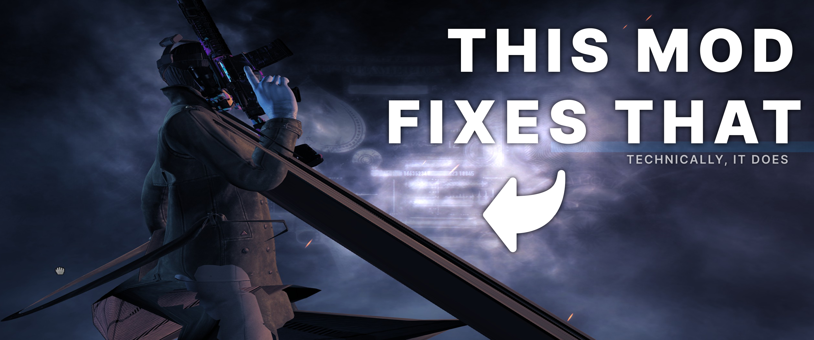

# Clothing Physics Fix

## Notes
- This mod uses a simple workaround to fix clothing physics issues in the main menu
- It completely disables clothing physics for **custom/modded outfits** while you are in the main menu. This prevents the stretching/glitching that happens when the character loads or is rotated
- Vanilla (official) outfits keep their normal physics
## How to whitelist an outfit? 
- If a custom outfit has properly working physics and you want it to keep physics in the menu, open the file `styles.lua` and add its ID to the list like this: `["your_outfit_id"] = true,`
- Usually the ID is specified in `main.xml`, `outfit.xml` or in the BeardLib definition files
## Installation
### If you don't have mods installed (Vanilla Game)
1. Download and install [SuperBLT](https://superblt.znix.xyz/) (place `WSOCK21.DLL` into your Payday 2 folder)
2. Launch the game once so SuperBLT can automatically create the `mods` folder, then close the game
3. Download the Clothing Physics Fix mod from [ModWorkshop](https://modworkshop.net/mod/58893) or [GitHub Releases](https://github.com/eidenvelsberg/pd2-clothing-physics-fix/releases)
4. Extract this mod folder into your `PAYDAY 2/mods/` directory
### If SuperBLT is already installed
1. Download the Clothing Physics Fix mod from [ModWorkshop](https://modworkshop.net/mod/58893) or [GitHub Releases](https://github.com/eidenvelsberg/pd2-clothing-physics-fix/releases)
2. Extract this mod folder into your `PAYDAY 2/mods/` directory
